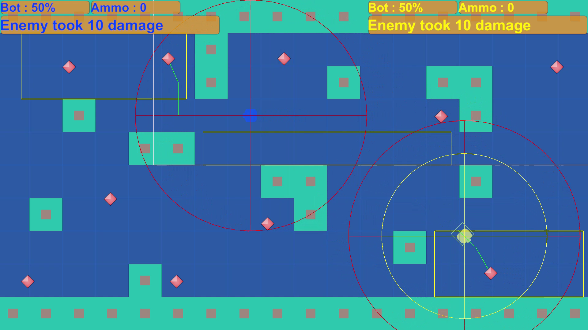

# Bot Arena



**Bot Arena** est un jeu d'arène 2D développé sous Unity, où deux bots IA s'affrontent dans une arène dynamique. Chaque bot utilise une machine à états finis (FSM), un système de pathfinding A\* et des comportements autonomes (patrouille, poursuite, tir, fuite, recharge, collecte d’items).

---

## 📋 Fonctionnalités

* **IA modulaire** basée sur une FSM : états Patrol, Chase, Shoot, Flee, Reload, CollectItem
* **Pathfinding** : Package A\* Pathfinding Project (GridGraph, Seeker, AILerp, AIDestinationSetter)
* **Système de tir** : projectiles instanciés, dégâts à l’impact, destruction sur obstacle
* **Soin & Bonus** : objets de soin apparaissant aléatoirement, ramassage par proximité
* **Interface utilisateur** : Canvas affichant santé, munitions et état des bots
* **Menus** : Main Menu (Play/Quit) et Game Over (Retry/Menu)
* **Game Manager** : gestion de la fin de partie, affichage du gagnant

---

## 🛠️ Prérequis

* Unity 2022 LTS (ou version compatible)
* Package **A* Pathfinding Project*\* 
* TextMeshPro (intégré à Unity)

---

## 🚀 Installation

1. Cloner ce dépôt :

   ```bash
   git clone https://github.com/israel-joel/bot-arena.git
   ```
2. Ouvrir le projet dans Unity Hub (sélectionner le dossier cloné).
3. Dans **Window > Package Manager**, vérifier que TextMeshPro et A\* Pathfinding Project sont importés.

---

## ▶️ Utilisation

### Menu Principal

* Ouvrir la scène `Assets/Scenes/MainMenu.unity`.
* Cliquer sur **Play** pour lancer la partie, ou **Quit** pour fermer l'application.

### Gameplay

* Les bots patrouillent automatiquement.
* Lorsqu'un bot détecte l'autre dans son champ de vision, il entre en ChaseState, puis ShootState à portée.
* S'ils manquent de munitions, ils chargent en ReloadState (cooldown non hostile).
* Si leur santé passe sous 25%, ils entrent en CollectItemState pour chercher un HealthItem.
* Les projectiles infligent des dégâts, se détruisent sur collision avec obstacles.

### Game Over

* À la mort d’un bot, le **GameOverCanvas** s’affiche avec le message du gagnant.
* Boutons : **Retry** relance la scène de jeu, **Menu** retourne au Main Menu.

---

## 📁 Structure du projet

```
Assets/
├── Art/                # Sprites, UI assets
├── Prefabs/            # Prefabs de bots, bullet, items, UI
├── Scenes/
│   ├── MainMenu.unity
│   └── Game.unity      # Scène principale du jeu
├── Scripts/
│   ├── AI/             # FSM states & controller
│   ├── Pathfinding/    # A* setup scripts
│   ├── UI/             # Game Manager, menus
│   └── Gameplay/       # Bullet, ItemSpawner, HealthItem
└── README.md
```

---

## 🤝 Contribution

Les contributions sont les bienvenues ! Pour proposer des améliorations :

1. Fork ce dépôt.
2. Crée une branche `feature/ma-fonctionnalite`.
3. Commit tes changements et pousse la branche.
4. Ouvre une Pull Request décrivant tes modifications.

---

**Amuse-toi bien et n'hésite pas à contribuer !**
